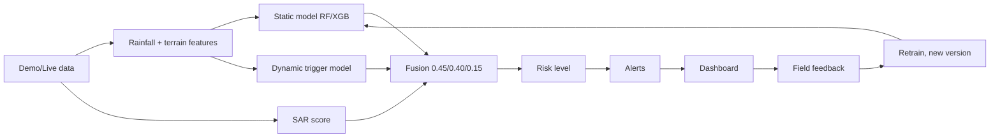

# TerraGuardX — landslide early-warning prototype (NER India)

> Prototype decision-support system. Predictions require validation and should not replace official disaster-management instructions.

**All bundled data is SYNTHETIC (DEMO).** Model metrics reflect a synthetic labelling rule and are *not* scientific validation.

## Pipeline

## Run
Docker: `cp .env.example .env && docker compose up --build` → UI http://localhost:5173, API http://localhost:8000, Swagger /docs.
Local backend: `cd backend && pip install -r requirements.txt && uvicorn app.main:app --reload` (SQLite by default).
Local frontend: `cd frontend && npm install && npm run dev`.
Demo logins: admin/admin123, authority/authority123, viewer/viewer123 (override via env; change before any non-demo use).
Regenerate data: `cd backend && python -c "from app import demo_data; demo_data.generate()"`. Train: `python -c "from app import models; models.train('static'); models.train('dynamic')"`.
Tests: `python -m pytest tests -q`.

## Live mode
`DATA_MODE=live` currently has **no adapters implemented**, so the app stays labelled DEMO rather than faking live data. To add: implement providers for NASA GPM IMERG (NASA_API_KEY/Earthdata), Copernicus Sentinel-1 (COPERNICUS_CLIENT_ID/SECRET), IMD, SRTM, OSM, and plug them into `pipeline.load_inputs()`.

## Limitations
Fusion weights/thresholds are prototype values. Confidence is a heuristic, not statistical certainty. SMS uses a mock provider unless TWILIO_* is set (needs `pip install twilio`). No IVR.
