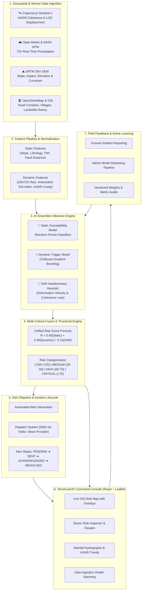

# 🌍 TerraGuardX

### AI-Powered Geospatial Landslide Risk Monitoring & Early Warning Decision-Support System
**Target Region:** Northeast India (NER) High-Relief Mountainous Corridors

---

[](https://fastapi.tiangolo.com/)
[](https://reactjs.org/)
[](https://vitejs.dev/)
[](https://scikit-learn.org/)
[](https://leafletjs.com/)
[](LICENSE)

---

## 📌 Executive Summary

**TerraGuardX** is an end-to-end, multi-tier disaster intelligence and geospatial early-warning platform designed to assess, predict, and mitigate landslide hazards in high-relief mountainous terrains. Built specifically for vulnerable districts in **Northeast India** (Assam, Meghalaya, Nagaland, Mizoram, Manipur, Arunachal Pradesh, Sikkim, and Tripura), TerraGuardX combines:

1. **Multi-Source Geospatial Ingestion**: Integrates real-time meteorological precipitation feeds (Open-Meteo & NASA GPM IMERG), satellite synthetic aperture radar ground deformation data (Copernicus Sentinel-1 InSAR), SRTM 30m Digital Elevation Models (DEM), and OpenStreetMap infrastructure networks.
2. **Dual-Model AI Prediction Engine**: Employs an ensemble of Random Forest for baseline static terrain susceptibility and XGBoost for dynamic rainfall trigger modeling.
3. **Multi-Criteria Risk Fusion**: Calculates a unified composite risk score ($0–100$) using adaptive weighting across geotechnical, hydrological, and radar interferometric indicators.
4. **Early Warning & Alert Dispatch System**: Automatically flags threshold breaches into four standardized alert severity tiers (**LOW**, **MEDIUM**, **HIGH**, **CRITICAL**), initiating automated multi-recipient dispatch (SMS / Webhook / Console).
5. **Human-in-the-Loop Feedback & Retraining**: Collects ground-truth field incident reports, validates historical events, and provides zero-downtime model retraining with version control.
6. **Command Center GIS UI/UX**: A dark-mode, responsive web console featuring interactive Leaflet risk maps, sector drawers, real-time gauges, time-series rainfall hyetographs, InSAR deformation profiles, and system health monitors.

> ⚠️ **Disclaimer:** *TerraGuardX is a prototype decision-support system developed for research, laboratory demonstration, and technical evaluation. Predictions require ground-truth validation and must not supersede official disaster management directives issued by the National Disaster Management Authority (NDMA) or State Disaster Management Authorities (SDMAs).*

---

## 🏗️ System Architecture & Data Flow



---

## 🚀 Key Features

### 1. Real-Time Meteorological & Hydrological Tracking
- Ingests **72-hour precipitation time series** for 48 high-risk monitoring sectors across Northeast India.
- Computes **24h cumulative rainfall**, **72h antecedent soil moisture saturation index**, and **peak hourly precipitation rate**.
- Integrates live endpoints from the Open-Meteo Global Hydrology API with seamless fallback to calibrated NASA GPM IMERG historical baselines.

### 2. Satellite Radar Interferometry (InSAR) Analysis
- Tracks **Line-of-Sight (LOS) millimeter surface displacement** and **interferometric coherence loss** derived from ESA Copernicus Sentinel-1 Synthetic Aperture Radar.
- Detects micro-ground creep before visible slope failure occurs.

### 3. AI Ensemble Modeling
- **Static Susceptibility Model (Random Forest)**: Evaluates intrinsic geological and terrain factors (slope, aspect, elevation, plan curvature, profile curvature, soil shear strength, distance to faults, distance to streams, and distance to roads).
- **Dynamic Trigger Model (XGBoost)**: Evaluates transient hydrometeorological triggers and antecedent moisture saturation.
- **Ensemble Output**: Generates continuous probability scores, factor attribution breakdowns, and model confidence metrics.

### 4. Interactive GIS Map & Command Center
- Built with **React Leaflet** styled with a custom dark-mode geospatial tile layer.
- Layer toggles for:
  - 🗺️ Sector Risk Heatmaps (color-coded by risk severity).
  - 🛣️ Primary and secondary mountain highway corridors (OpenStreetMap).
  - 🏘️ High-vulnerability settlement points and population exposure buffers.
  - ⚠️ Historical landslide incident inventory with volumetric failure records.
- Side-panel sector inspector with factor attribution radial gauges, rainfall hyetographs, and dispatch actions.

### 5. Role-Based Access Control (RBAC) & Security
- **JWT (JSON Web Token)** authentication supporting three distinct operational roles:
  - **Admin**: Full access to all controls, trigger simulations, real-time sync, dispatch SMS alerts, toggle live/demo modes, and trigger model retraining.
  - **Authority**: Disaster management operations, simulation executions, alert acknowledgments, and field feedback submission.
  - **Viewer**: Read-only access to GIS maps, analytics, sector data, and performance metrics.

---

## 📂 Repository Structure

```
terraguardx/
├── backend/                        # FastAPI Backend Application
│   ├── app/
│   │   ├── __init__.py
│   │   ├── config.py              # Environment configuration & runtime defaults
│   │   ├── db.py                  # SQLAlchemy models & SQLite database bindings
│   │   ├── models.py              # ML model definitions (RF & XGBoost), training, persistence
│   │   ├── adapters.py            # Real-time data connectors (Open-Meteo, Sentinel-1 InSAR)
│   │   ├── fusion.py              # Multi-criteria risk fusion heuristics
│   │   ├── pipeline.py            # Simulation pipeline coordinator & feature synthesis
│   │   ├── alerts.py              # Alert generation, formatting, and Twilio SMS provider
│   │   ├── demo_data.py           # Synthetic dataset generator for offline / fallback demo
│   │   └── main.py                # FastAPI REST routes, CORS, auth, and startup lifecycles
│   ├── models/                    # Serialized model artifacts (.joblib, metadata JSON)
│   ├── requirements.txt           # Python dependencies
│   └── terraguardx.db             # SQLite database file (auto-initialized)
│
├── frontend/                       # React 18 + TypeScript + Vite Dashboard
│   ├── src/
│   │   ├── assets/
│   │   │   └── svgs/              # Topographic grid, radar rings, and terrain SVG assets
│   │   ├── components/
│   │   │   ├── layout/            # Sidebar, Topbar, PageContainer
│   │   │   ├── common/            # DisclaimerBanner, StatusBadge, DataModeBadge, Modal
│   │   │   ├── dashboard/         # KPIGrid, KPICard, RiskGauge, RiskBreakdown, ActivityFeed
│   │   │   ├── map/               # RiskMap, MapControls, MapLegend, ZoneDrawer
│   │   │   ├── alerts/            # AlertTable, IncidentSummary
│   │   │   ├── satellite/         # SARCard, DeformationChart
│   │   │   ├── terrain/           # SectorGrid, TerrainCard
│   │   │   ├── model/             # MetricCard, FeatureImportanceChart, ConfusionMatrix
│   │   │   └── data/              # DataHealth, IngestionMatrix
│   │   ├── context/
│   │   │   └── AppContext.tsx     # Global React state, auth recovery, simulation triggers
│   │   ├── pages/                 # 12 Comprehensive Command Center Pages
│   │   │   ├── LoginPage.tsx
│   │   │   ├── OverviewPage.tsx
│   │   │   ├── LiveRiskMapPage.tsx
│   │   │   ├── ZoneAnalysisPage.tsx
│   │   │   ├── ExposurePage.tsx
│   │   │   ├── RainfallPage.tsx
│   │   │   ├── SatellitePage.tsx
│   │   │   ├── TerrainPage.tsx
│   │   │   ├── AlertsPage.tsx
│   │   │   ├── FieldFeedbackPage.tsx
│   │   │   ├── ModelPerformancePage.tsx
│   │   │   ├── DataHealthPage.tsx
│   │   │   └── SettingsPage.tsx
│   │   ├── services/
│   │   │   └── api.ts             # Typed REST API client & Axios/fetch abstraction
│   │   ├── styles/
│   │   │   ├── designTokens.ts    # Hex color tokens, risk levels, typography variables
│   │   │   └── index.css          # Global CSS, glassmorphism, radar animations
│   │   ├── types/
│   │   │   └── index.ts           # Full TypeScript data contracts
│   │   ├── App.tsx
│   │   └── main.tsx
│   ├── package.json
│   ├── tsconfig.json
│   └── vite.config.ts
│
├── datasets/
│   ├── demo/                      # Baseline synthetic DEMO datasets
│   │   ├── terrain.csv            # 48 monitoring sectors with geotechnical coordinates
│   │   ├── rainfall.csv           # 72h baseline hourly precipitation readings
│   │   ├── satellite_features.csv # Baseline Sentinel-1 InSAR deformations
│   │   ├── landslides.csv         # Historical landslide catalog
│   │   ├── static_training.csv    # Training samples for static susceptibility model
│   │   ├── dynamic_training.csv   # Training samples for dynamic rainfall trigger model
│   │   ├── roads.geojson          # Transportation network vector features
│   │   └── villages.geojson       # Vulnerable settlement vector features
│   └── live/                      # Real-time cached ingestion files (auto-generated)
│       ├── live_rainfall.csv
│       └── live_satellite_features.csv
│
├── tests/
│   ├── test_core.py               # Backend unit & integration test suite (Pytest)
│   └── verify_frontend_backend.py # End-to-end integration validation script
│
├── docker-compose.yml             # Container orchestration
├── Dockerfile                     # Multi-stage production container build
├── .env.example                   # Environment template
└── README.md                      # Project documentation
```

---

## ⚙️ Configuration & Environment Variables (`.env`)

Create a `.env` file in the root directory by copying `.env.example`:

```bash
cp .env.example .env
```

| Variable | Description | Default |
| :--- | :--- | :--- |
| `DATA_MODE` | Runtime ingestion mode (`live` or `demo`) | `live` |
| `DATABASE_URL` | SQLAlchemy connection string | `sqlite:///terraguardx.db` |
| `JWT_SECRET` | Secret key used to sign and verify operator JWT tokens | `dev-only-change-me-32chars` |
| `ADMIN_PASSWORD` | Secure password for the `admin` operator account | `Sasikarthi@123` |
| `AUTHORITY_PASSWORD` | Password for disaster authority personnel | `Sasikarthi@1234` |
| `VIEWER_PASSWORD` | Password for read-only viewer accounts | `Sasikarthi@12345` |
| `W_STATIC` | Multi-criteria fusion weight for Static Terrain Susceptibility | `0.45` |
| `W_DYNAMIC` | Multi-criteria fusion weight for Dynamic Rainfall Trigger | `0.40` |
| `W_SAR` | Multi-criteria fusion weight for InSAR Ground Deformation | `0.15` |
| `COPERNICUS_CLIENT_ID` | *(Optional)* Copernicus Data Space Hub API Client ID | `""` |
| `COPERNICUS_CLIENT_SECRET`| *(Optional)* Copernicus Data Space Hub API Secret | `""` |
| `TWILIO_ACCOUNT_SID` | *(Optional)* Twilio account SID for live SMS dispatch | `""` |
| `TWILIO_AUTH_TOKEN` | *(Optional)* Twilio auth token | `""` |
| `TWILIO_FROM_NUMBER` | *(Optional)* Twilio sender phone number | `""` |

---

## 🛠️ Installation & Setup

### Prerequisites
- **Python 3.10+** (Tested on Python 3.11 & 3.13)
- **Node.js 18+** & **npm 9+**
- **Git**

---

### Option 1: Local Development Setup (Recommended)

#### 1. Backend Setup
```bash
# Navigate to backend directory
cd backend

# Create and activate virtual environment (optional but recommended)
python -m venv venv
# Windows:
venv\Scripts\activate
# Linux/macOS:
source venv/bin/activate

# Install dependencies
pip install -r requirements.txt

# Start FastAPI server with live reload
uvicorn app.main:app --port 8000 --reload
```
*Backend runs at:* **`http://localhost:8000`**  
*Interactive Swagger API Docs:* **`http://localhost:8000/docs`**

---

#### 2. Frontend Setup
```bash
# Open a new terminal and navigate to frontend directory
cd frontend

# Install Node dependencies
npm install

# Start Vite dev server
npm run dev
```
*Frontend dashboard opens at:* **`http://localhost:5173`**

---

### Option 2: Docker Compose Setup

Run the entire stack with a single command:

```bash
docker compose up --build -d
```
- Dashboard UI: `http://localhost:5173`
- API Backend: `http://localhost:8000`
- Swagger UI: `http://localhost:8000/docs`

---

## 🔐 Operator Access & Role Credentials

The system includes 3 pre-configured operator roles:

| Role | Username | Password | Operational Permissions |
| :--- | :--- | :--- | :--- |
| **Admin** | `admin` | `Sasikarthi@123` *(or `admin123`)* | Full control: Run simulation, sync live data, dispatch SMS alerts, switch modes, trigger model retraining |
| **Authority** | `authority` | `Sasikarthi@1234` *(or `authority123`)* | Operational: Run simulation, sync live data, submit field feedback, acknowledge alerts |
| **Viewer** | `viewer` | `Sasikarthi@12345` *(or `viewer123`)* | Read-only: View GIS maps, telemetry charts, sector details, and model performance |

---

## 📊 API Documentation & Endpoints

| Method | Endpoint | Access Level | Description |
| :--- | :--- | :--- | :--- |
| `GET` | `/api/health` | Public | System status, active data mode, and disclaimer |
| `POST` | `/api/auth/login` | Public | Authenticates operator and returns signed JWT |
| `GET` | `/api/risk` | All Roles | Returns latest risk scores and factor attribution for all 48 sectors |
| `GET` | `/api/risk/map` | All Roles | Returns GeoJSON FeatureCollection of sectors with risk attributes |
| `GET` | `/api/risk/{zone_id}` | All Roles | Detailed risk breakdown for a single sector |
| `GET` | `/api/rainfall/{zone_id}` | All Roles | 72h precipitation time series (Open-Meteo live / baseline) |
| `GET` | `/api/satellite` | All Roles | Sentinel-1 InSAR ground deformation observations |
| `GET` | `/api/exposure` | All Roles | OpenStreetMap roads and villages GeoJSON features |
| `GET` | `/api/alerts` | All Roles | Historical & active alert incident log |
| `POST` | `/api/alerts/send` | Admin / Authority | Dispatches or updates alert status (send / acknowledge / resolve) |
| `POST` | `/api/prediction` | Admin / Authority | Executes the complete real-time AI inference & fusion pipeline |
| `POST` | `/api/realtime/sync` | Admin / Authority | Triggers immediate synchronization with live Open-Meteo & Copernicus APIs |
| `POST` | `/api/feedback` | Admin / Authority | Submits field-validated ground truth incident reports |
| `GET` | `/api/model/performance`| All Roles | Evaluation metrics (Accuracy, ROC-AUC, F1, Confusion Matrix) |
| `GET` | `/api/model/features` | All Roles | Feature importance rankings for static and dynamic models |
| `POST` | `/api/admin/retrain` | Admin Only | Incremental model retraining incorporating validated field feedback |
| `GET` | `/api/data-status` | All Roles | Health telemetry across all data adapters and sensor streams |
| `POST` | `/api/settings/mode` | Admin Only | Toggles system data mode between `LIVE` and `DEMO` |

---

## 🧪 Testing & Validation

### Running Backend Unit & Flow Tests
```bash
python -m pytest tests -q
```
*Executes all test cases including API route authentication, RBAC authorization, ML inference consistency, and fusion logic.*

### Running End-to-End Integration Verification
```bash
python tests/verify_frontend_backend.py
```
*Validates health endpoints, authenticates with configured credentials, checks Open-Meteo real-time ingestion, runs simulation, and verifies frontend availability.*

### Running Frontend Type Checks & Production Build
```bash
cd frontend
npm run build
```
*Runs `tsc --noEmit` and bundles optimized production assets via Vite.*

---

## 📈 Machine Learning Formulation

### 1. Static Susceptibility Model (Random Forest)
$$P_{\text{static}} = f_{\text{RF}}(\text{Slope}, \text{Aspect}, \text{Elevation}, \text{Curvature}_{\text{plan}}, \text{Curvature}_{\text{profile}}, \text{Lithology}, \text{TWI}, D_{\text{fault}}, D_{\text{stream}}, D_{\text{road}})$$

### 2. Dynamic Hydrological Trigger Model (XGBoost)
$$P_{\text{dynamic}} = f_{\text{XGB}}(R_{24\text{h}}, R_{72\text{h}}, I_{\text{peak}}, S_{\text{antecedent}}, \text{SoilMoisture})$$

### 3. Satellite SAR Heuristic Indicator
$$P_{\text{SAR}} = \min\left(100, \frac{|\Delta_{\text{LOS}}| \times 12.5}{\text{Coherence} + 0.1}\right)$$

### 4. Multi-Criteria Risk Fusion Equation
$$\text{Risk Score} = w_s \cdot P_{\text{static}} + w_d \cdot P_{\text{dynamic}} + w_r \cdot P_{\text{SAR}}$$
$$\text{where } w_s = 0.45, \quad w_d = 0.40, \quad w_r = 0.15, \quad \sum w_i = 1.0$$

---

## 📜 License

This project is licensed under the **MIT License** — see the [LICENSE](LICENSE) file for details.

---

## 👥 Acknowledgments & Data Sources

- **Open-Meteo Global Hydrology API**: High-resolution meteorological and precipitation forecasting.
- **NASA Earthdata & GPM IMERG**: Global Precipitation Measurement satellite baseline data.
- **ESA Copernicus Data Space Hub**: Sentinel-1 C-Band Synthetic Aperture Radar InSAR.
- **USGS / NASA SRTM**: 30m Global 1-Arcsecond Digital Elevation Model.
- **Geological Survey of India (GSI)**: Historical national landslide inventories and lithological classifications.
- **OpenStreetMap Contributors**: Transportation corridors and rural settlement data.
